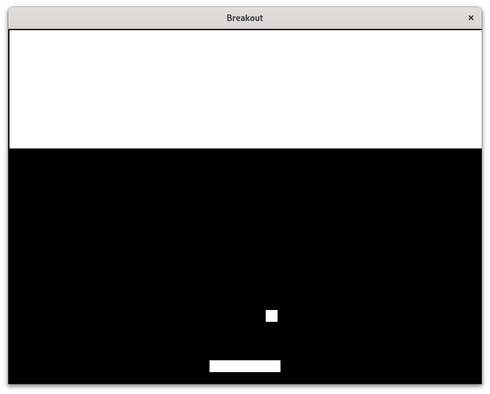
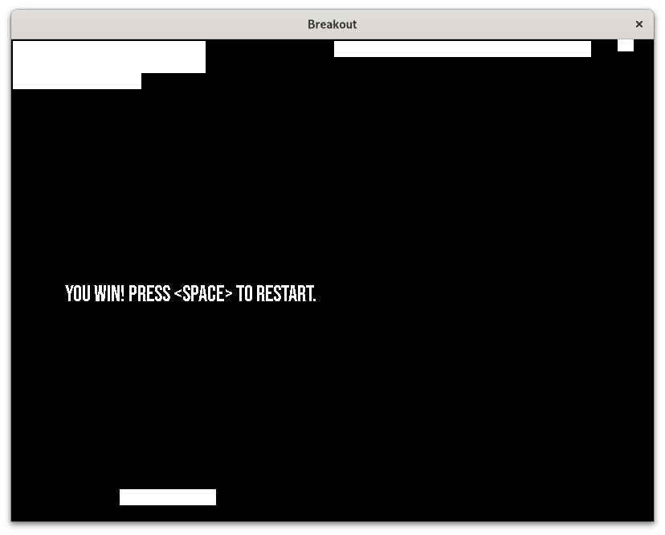
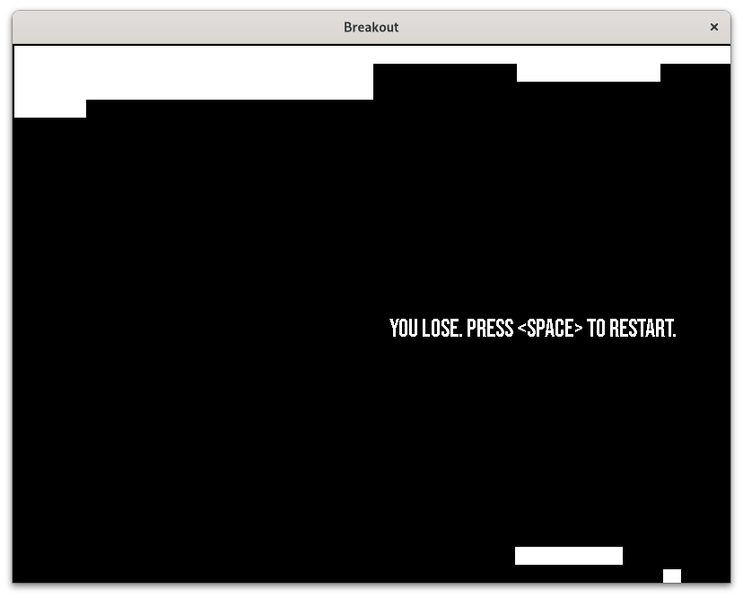

# Breakout

Breakout is a game developed by Radon Therapy using SDL2.

## Project Scope

We aim to implement a very basic version of Breakout game with the following features:

1. C99 and SDL2
2. Separated functions
3. Single file
4. Win/lose scenario
5. Restart

We are not trying to include the following:

1. Separated files
2. Menu screen
3. Options, such as fullscreen
4. Resizable window

## Build Instructions

In the main directory, run the following command:

`make all`

To clean up, run:

`make clean`

## Screenshots

## License

The Bebas Neue font is licensed under OFL.

For other code and assets, please read the LICENSE file.
